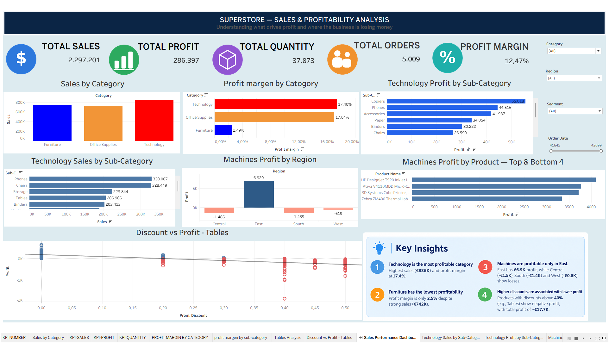

# Superstore Sales & Profitability Analysis

## About the project

I worked with the Superstore dataset to understand how the business is performing and, more importantly, where it is making and losing money.

I used SQL for the main analysis, Python to explore the data and create visualizations, and Tableau to build an interactive dashboard.

The dataset contains 9,994 transactions covering orders from 2014 to 2017.

## Questions I wanted to answer

- Which categories generate the most sales?
- Which categories are the most profitable?
- Which products and sub-categories are losing money?
- Which regions perform better?
- How are discounts related to profit?
- Which customer segments generate more value?

## Tools

- MySQL / SQL
- Python
- Pandas
- Matplotlib
- Seaborn
- Tableau

## Dataset

- 9,994 transactions
- 5,009 orders
- 793 customers
- 1,862 products
- 3 categories
- 17 sub-categories
- 2014–2017

## Main results

| Metric | Result |
|---|---:|
| Sales | $2.30M |
| Profit | $286.4K |
| Profit Margin | 12.47% |
| Orders | 5,009 |
| Customers | 793 |

## Key findings

### Technology performed the best

Technology generated around **$836K in sales** and approximately **$145K in profit**, with a profit margin of about **17.4%**.

### Furniture had weak profitability

Furniture generated around **$742K in sales**, but only around **$18.5K in profit**.

Its profit margin was approximately **2.5%**.

### Tables were losing money

Tables generated around **$207K in sales**, but approximately **-$17.7K in profit**.

Higher discount levels were also generally associated with lower profitability.

### Copiers were highly profitable

Copiers generated approximately **$55.6K in total profit**, making them the strongest sub-category by total profit.

## Business recommendations

1. Review pricing and discount strategies for Furniture.
2. Investigate the products inside the Tables sub-category.
3. Pay particular attention to products receiving large discounts.
4. Continue focusing on profitable Technology products.
5. Compare regional performance to understand weaker areas.

## Tableau Dashboard

I built an interactive Tableau dashboard to make the analysis easier to explore.

It includes:

- Sales and profit KPIs
- Sales by category
- Profit margin by category
- Sub-category performance
- Regional analysis
- Product profitability
- Discount vs. profit
- Key business insights



## Analysis process

```text
Superstore Dataset
        ↓
Data Quality Check
        ↓
SQL Analysis
        ↓
Python Analysis
        ↓
Visualizations
        ↓
Business Insights
        ↓
Recommendations
        ↓
Tableau Dashboard
```

## Project structure

```text
superstore-sales-profitability-analysis/
├── data/
│   └── superstore.csv
├── sql/
│   └── superstore_analysis.sql
├── python/
│   └── superstore_analysis.py
├── tableau/
│   └── Superstore_Sales_Profitability_Dashboard.twbx
├── images/
│   └── dashboard.png
└── README.md
```

## What I learned

This project helped me practice the complete data analysis process, from checking raw data and writing SQL queries to analyzing data with Python, creating visualizations, and presenting the results in Tableau.

One of the main things I learned is that **sales alone don't tell the whole story**. A category can generate a lot of revenue and still have poor profitability.

---

**Tools:** SQL · Python · Pandas · Matplotlib · Seaborn · Tableau
